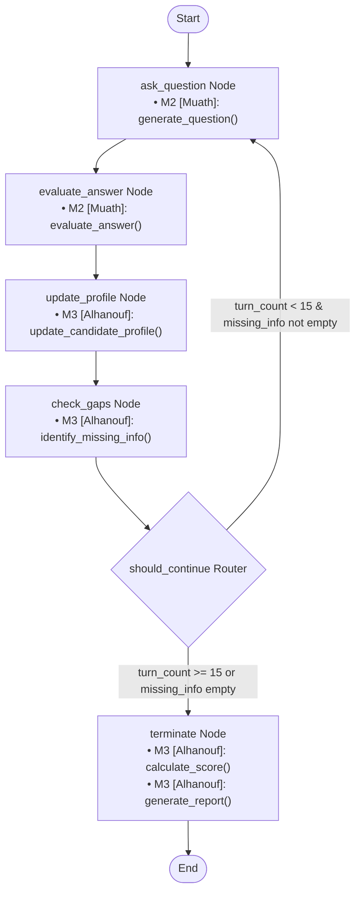

# AI-Interview-Agent

An agentic AI coding assistant designed to conduct turn-by-turn bootcamp candidate interviews. It uses LangGraph to orchestrate state updates, evaluate candidate answers, track topic coverage, and compile final summary reports.

---

## Directory Layout

```text
agent/
├── state.py          # InterviewState TypedDict definition
├── tools.py          # Tool contracts and integration stubs
├── nodes.py          # StateGraph transition nodes
├── graph.py          # Graph assembly, conditional routing, and compilation
├── main.py           # CLI testing runner with Windows terminal compatibility
└── test_agent.py     # Automated programmatic test suite
```

---

## Getting Started

### Prerequisites
- Python 3.11+ (tested up to Python 3.14)
- `langgraph` package

### Installation
Install `langgraph` and its dependencies:
```bash
pip install langgraph
```

### Running the CLI Simulator
Execute the following command from the project root:
```bash
python agent/main.py
```

### Running Tests
Execute the automated test suite to assert correct graph transitions:
```bash
python agent/test_agent.py
```

---

## Graph Flow & Integration Points

The agent operates as a state machine orchestrated via LangGraph. 

Below is the Mermaid flow diagram of the graph, showing the exact nodes and where **M2 [Muath]** and **M3 [Alhanouf]** features integrate:



### Integration Details

| Node | Target File | Stub Function | Module Assignment | Purpose |
| :--- | :--- | :--- | :--- | :--- |
| `ask_question` | `agent/tools.py` | `generate_question()` | **M2 [Muath]** | Generates the next interview question based on the topic context and asked history. |
| `evaluate_answer` | `agent/tools.py` | `evaluate_answer()` | **M2 [Muath]** | Scores the candidate's last answer using a predefined rubric. |
| `update_profile` | `agent/tools.py` | `update_candidate_profile()` | **M3 [Alhanouf]** | Stores the candidate's latest topic scores and responses to their profile. |
| `check_gaps` | `agent/tools.py` | `identify_missing_info()` | **M3 [Alhanouf]** | Checks the candidate's covered topics against required syllabus topics. |
| `terminate` | `agent/tools.py` | `calculate_score()` | **M3 [Alhanouf]** | Computes the overall average score from topic-specific evaluation scores. |
| `terminate` | `agent/tools.py` | `generate_report()` | **M3 [Alhanouf]** | Compiles the final candidate summary report. |

*In Week 2, these stubs will be swapped with real implementations, and the Graph compilation in `agent/graph.py` will be updated to pause execution via `interrupt_before=["evaluate_answer"]` for frontend/API integrations.*
