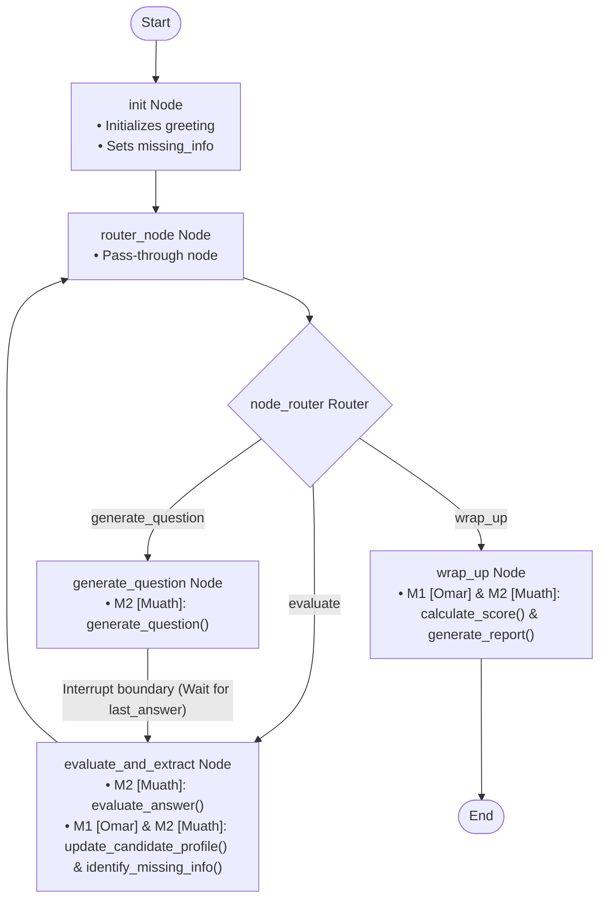

# AI-Interview-Agent

An agentic AI coding assistant designed to conduct turn-by-turn bootcamp candidate interviews. It uses LangGraph to orchestrate state updates, evaluate candidate answers, track topic coverage, and compile final summary reports.

---

## Directory Layout

```text
agent/
├── state.py          # InterviewState TypedDict definition
├── tools.py          # Tool contracts and integration stubs
├── nodes.py          # StateGraph transition nodes
├── graph.py          # Graph assembly, pass-through routing, and compilation
├── main.py           # CLI testing runner with Windows terminal compatibility
└── test_agent.py     # Automated programmatic test suite
```

---

## Getting Started

### Prerequisites
- Python 3.11+ (tested up to Python 3.14)

### Installation
Install the required dependencies from [requirements.txt](file:///c:/Users/nbton/OneDrive%20-%20KFUPM/Interview_Agent/requirements.txt):
```bash
pip install -r requirements.txt
```

### Running the CLI Simulator
Execute the following command from the project root:
```bash
python agent/main.py
```

### Running Tests
Execute the automated test suite to assert correct graph transitions and checkpoint handling:
```bash
python agent/test_agent.py
```

---

## Graph Flow & Integration Points

The agent operates as a state machine orchestrated via LangGraph. 

Below is the Mermaid flow diagram of the graph, showing the exact nodes, the interrupt boundaries, and where **M1 [Omar]** and **M2 [Muath]** features integrate:



### Integration Details

| Node | Target File | Stub Function | Module Assignment | Purpose |
| :--- | :--- | :--- | :--- | :--- |
| `generate_question` | `agent/tools.py` | `generate_question()` | **M2 [Muath]** | Generates the next interview question based on the topic context and asked history. |
| `evaluate_and_extract` | `agent/tools.py` | `evaluate_answer()` | **M2 [Muath]** | Scores the candidate's last answer and extracts skills. |
| `evaluate_and_extract` | `agent/tools.py` | `update_candidate_profile()` | **M1 [Omar] & M2 [Muath]** | Persists candidate progress to PostgreSQL database after each turn. |
| `evaluate_and_extract` | `agent/tools.py` | `identify_missing_info()` | **M1 [Omar] & M2 [Muath]** | Updates candidate covered topics against required syllabus topics. |
| `wrap_up` | `agent/tools.py` | `calculate_score()` | **M1 [Omar] & M2 [Muath]** | Computes the overall candidate score (rounded to 2 decimal places). |
| `wrap_up` | `agent/tools.py` | `generate_report()` | **M1 [Omar] & M2 [Muath]** | Compiles the final candidate summary report and persists it to the database. |

---

## Technical Details

### AI Inference Architecture (OpenAI with OpenRouter Fallback)
The LLM inference setup is configured for resilience:
- **Primary Inference**: Uses the OpenAI API (`gpt-4o-mini`) via `OPENAI_API_KEY`.
- **Fallback Inference**: If the primary client fails (e.g. rate limits, network error) or the OpenAI key is missing, it automatically falls back to OpenRouter (`openrouter/free`) via `OPENROUTER_API_KEY` using LangChain's native `with_fallbacks` mechanism.

### Database Integration (PostgreSQL / Supabase)
A robust PostgreSQL database integration (via Supabase client) is implemented to track candidate progress:
- **Active Tables**:
  - `candidate_responses` / `candidate_profiles`: Tracks per-turn answers, topics, and scores.
  - `candidate_reports`: Stores final candidate summaries, overall ratings, and topic scores.
- **Environment Variables**:
  - `SUPABASE_URL`: The API URL of your Supabase project.
  - `SUPABASE_KEY`: The service role API key of your Supabase database.

### State Interrupt & Resuming
The graph is compiled with `interrupt_before=["evaluate_and_extract"]`. When transitioning from `generate_question` to `evaluate_and_extract`, execution automatically pauses.

To supply the candidate's response and resume the graph:
1. **Update State**: Use `graph.update_state(config, {"last_answer": user_input})` to write the input value to the checkpoint.
2. **Resume**: Call `graph.invoke(None, config)` to resume execution from the paused node.

