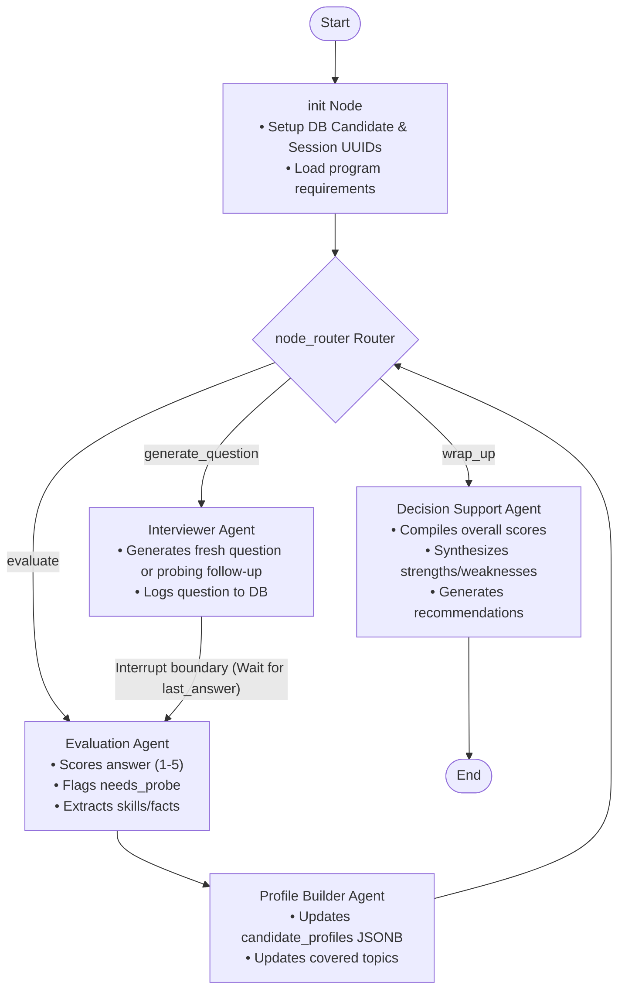
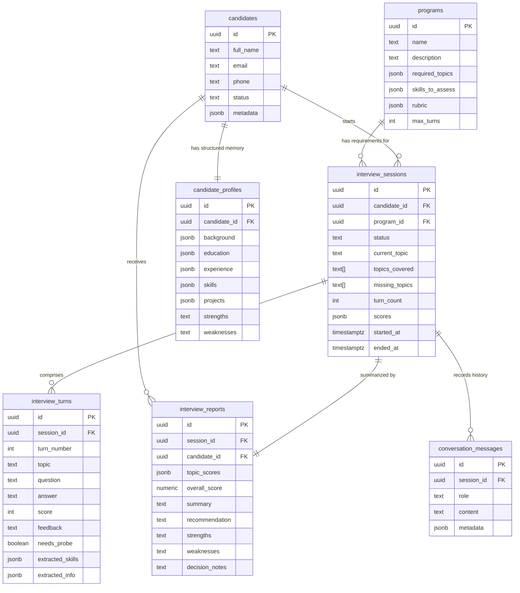

# AI-Interview-Agent

An agentic AI coding assistant designed to conduct turn-by-turn bootcamp candidate interviews. It uses a **Multi-Agent architecture** built on **LangGraph** to orchestrate state updates, evaluate candidate answers against program rubrics, track topic coverage, update long-term structured memory, and compile final summary reports.

---

## Architecture Overview

### Multi-Agent State Graph

The interview agent is organized as a state machine. It contains four specialized, cooperative agents that handle different tasks:



### Database Schema (Supabase / PostgreSQL)

The backend uses a normalized 7-table schema to track candidates, profiles (long-term memory), sessions, turns, and final reports:



---

## Agent Roles & Responsibilities

| Agent | Responsibility | Key Actions |
| :--- | :--- | :--- |
| **Interviewer Agent** | Conducts conversation & generates questions | Evaluates covered topics to ask the next fresh question, or crafts a targeted probing follow-up if the previous response was weak. Logs questions to `conversation_messages`. |
| **Evaluation Agent** | Scores answers & extracts structured metadata | Grades candidate answers on a strict 1-5 scale using program rubrics. Extracts skills, constructs `extracted_info` structures (e.g., job titles, universities), and flags `needs_probe` if an answer is too brief/vague. |
| **Profile Builder Agent** | Consolidates memory & tracks state transitions | Records turns in `interview_turns`. Updates the candidate's structured profile (long-term memory JSONB columns in `candidate_profiles`). Increments `probe_count` or marks topics complete. |
| **Decision Support Agent** | Compiles final report & recommendations | Runs upon interview completion to average scores, compile strengths and weaknesses using LLM reasoning, output final recommendations (`accept`, `review`, or `reject`), and save to `interview_reports`. |

---

## Expected Flow

1. **Initialization**: The graph starts at the `init` node. It sets up the candidate and session registry inside the database and initializes missing topics (`background`, `education`, `experience`, `skills`, `projects`).
2. **Interviewer Prompt**: The Interviewer Agent identifies the first topic (`background`), generates a topic-specific question, logs it, and transitions to evaluation.
3. **Interrupt Boundary**: Because `evaluation` is an interrupt node, the graph pauses execution and waits for candidate input.
4. **Resuming with Answer**: The candidate supplies an answer, setting `last_answer`. The graph resumes.
5. **Evaluation & Memory Consolidation**: The Evaluation Agent scores the response. The Profile Builder Agent records the turn, appends extracted facts to `candidate_profiles`, and updates topic coverage.
6. **Adaptive Probing**: If the Evaluation Agent set `needs_probe = true` (and we have probed less than 2 times on this topic), the topic is *not* marked as covered. The Interviewer Agent will generate a follow-up question related specifically to their previous response.
7. **Wrap Up**: When all topics are complete, or the turn limit is reached, the Decision Support Agent synthesizes the overall report, updates candidate status, and concludes the interview.

---

## Project Directory Reorganization

The codebase has been reorganized into a structured layout under a `src/` directory to cleanly separate application layers (agent, API backend, and Streamlit frontend):

```
Interview_Agent/
├── src/
│   ├── agent/            # LangGraph agent state machine, nodes, custom tools, and prompt definitions
│   ├── backend/          # FastAPI API backend routers and server configuration
│   └── frontend/         # Streamlit recruitment dashboard, candidate verification, and chatbot UI
├── tests/                # Integration and persona-based simulation tests
├── data/                 # Local Excel candidate spreadsheets (local fallbacks)
├── supabase/             # PostgreSQL database schemas and migration scripts
├── README.md             # Project documentation
├── pyproject.toml        # Project configuration
├── requirements.txt      # Project dependencies
└── .env                  # Environment configurations (API keys, Supabase URLs)
```

---

## Recent Integration Merge Details

The recent merge successfully unified the Frontend (Streamlit), Backend (FastAPI), and Agent (LangGraph) layers:
- **Unified Candidate Data Access**: Switched the Streamlit frontend from querying local Excel files directly to querying candidates through the FastAPI backend (`/api/candidates` and `/api/candidates/verify`), ensuring data integrity and database syncing.
- **Offline and LLM Fallback Robustness**: Integrated OpenRouter models (`nex-agi/nex-n2-pro:free`, etc.) as secondary fallbacks when OpenAI credentials are not provided or rate limits occur. Created local rule-based evaluations for offline candidate scoring and probing, ensuring the system never hangs or crashes without APIs.
- **Session Identity Propagation**: Fixed candidate verification workflows to store emails in frontend session states, cleanly routing verification states to the interview Chatbot. Added redirect guards to block unverified candidate entries.
- **DB Syncing & Export**: Integrated candidate dashboard status updates directly with the Supabase database. Added an **Export to Excel** downloader in the Recruiter Dashboard for exporting candidate records on the fly.
- **Performance Adjustments**: Scaled total interview questions to a consistent 5 required topics and added `120s` thread execution timeouts to prevent hanging calls.

---

## Installation & Running Instructions

### Prerequisites
- Python 3.11+ (up to Python 3.14)
- An OpenAI API Key (configured in your `.env` file)
- (Optional) A Supabase project with migration 002 applied

### Installation
Clone the repository and install the dependencies:
```bash
pip install -r requirements.txt
```

Set up your `.env` file in the root directory:
```env
OPENAI_API_KEY=your_openai_api_key_here
SUPABASE_URL=your_supabase_project_url_here
SUPABASE_KEY=your_supabase_service_role_key_here
```
*Note: If no Supabase URL/Key is provided, the agent automatically falls back to offline/stub mode, printing database operations to the console.*

### Running the CLI Simulator
Execute the interactive turn-by-turn interview simulator:
```bash
python src/agent/main.py
```

### Running Automated Tests

We provide two test suites to verify the multi-agent graph:

1. **Basic Flow Verification**: Run a simple single-candidate simulation loop:
   ```bash
   python agent/test_agent.py
   ```

2. **Multi-Scenario Dynamic Test Suite**: Run a comprehensive verification suite that dynamically tests three candidate personas using an LLM-driven candidate simulator to model realistic interview turn interactions:
   ```bash
   python agent/test_scenarios.py
   ```

#### Candidate Personas in `test_scenarios.py`:
- **Strong Candidate**: Provides detailed, high-quality technical responses on the first try. Progresses directly without triggering probing, achieving a perfect `5.0/5.0` score and an `ACCEPT` recommendation.
- **Improving Candidate**: Starts with vague/brief answers that trigger adaptive probing. When probed, elaborates with detailed, competent technical responses, resolving the topic and achieving a recommendation of `ACCEPT` or `REVIEW`.
- **Weak Candidate**: Fails to provide details initially and repeatedly when probed. Triggers the maximum consecutive probes per topic (2 probes) before forcing progress, achieving a low score and a `REJECT` recommendation.

---

## Sample Test Case Output (Adaptive Probing Example)

Here is an extract from `test_agent.py` showing how the agents coordinate to perform adaptive probing when the candidate provides a brief response for the `skills` topic:

```text
[Simulator] Current Topic: skills
[Agent Question]: Can you describe a project where you utilized Python for a machine learning application...
[Candidate Answer]: I am highly proficient in Python, SQL databases, and Machine Learning basics like Scikit-Learn.

🕵️‍♂️ [Evaluation Agent] Evaluating response for topic 'skills'...
🗂️ [Profile Builder Agent] Saving details & updating memory for 'skills'...
🔍 [Profile Builder Agent] Topic 'skills' requires follow-up probing (consecutive probes: 1/2).

🎤 [Interviewer Agent] Generating follow-up probing question for topic 'skills'...
[Evaluation Feedback]: The candidate's response indicates proficiency in Python, SQL databases, and basic ML, but lacks detail on their approach to learning new libraries...
[Extracted Skills]: ['Python', 'SQL', 'Machine Learning', 'Scikit-Learn']
[Needs Probe?]: True | [Probe Count]: 1

[Simulator] Current Topic: skills
[Agent Question]: Can you describe a specific instance where you utilized Scikit-Learn in a project, detailing the steps you took to implement the library and how you communicated your approach to your team?
[Candidate Answer]: I am highly proficient in Python, SQL databases, and Machine Learning basics like Scikit-Learn.

🕵️‍♂️ [Evaluation Agent] Evaluating response for topic 'skills'...
🗂️ [Profile Builder Agent] Saving details & updating memory for 'skills'...
🔍 [Profile Builder Agent] Topic 'skills' requires follow-up probing (consecutive probes: 2/2).

🎤 [Interviewer Agent] Generating follow-up probing question for topic 'skills'...
[Needs Probe?]: True | [Probe Count]: 2

[Simulator] Current Topic: skills
[Agent Question]: Can you provide a detailed example of a project where you implemented Scikit-Learn, including the specific algorithms you used, how you preprocessed your data, and any challenges you faced during the implementation?
[Candidate Answer]: I am highly proficient in Python, SQL databases, and Machine Learning basics like Scikit-Learn.

🕵️‍♂️ [Evaluation Agent] Evaluating response for topic 'skills'...
🗂️ [Profile Builder Agent] Saving details & updating memory for 'skills'...
✅ [Profile Builder Agent] Topic 'skills' coverage completed.
```

---

## Web API & Frontend Interface

### API Endpoints
| Endpoint | Method | Status |
| :--- | :--- | :--- |
| `/health` | GET | ✅ Working |
| `/api/candidates/verify` | POST | ✅ Working |
| `/api/candidates` | GET | ✅ Working |
| `/api/candidates/{name}` | GET | ✅ Working |
| `/api/recruiter/login` | POST | ✅ Working |
| `/api/interview/start` | POST | ✅ Working |
| `/api/interview/answer` | POST | ✅ Working |
| `/api/interview/session/{id}` | GET | ✅ Working |

### Running the Web Application

To run the complete application, you can start the backend FastAPI server and the Streamlit frontend interface.

#### 1. Start the Backend API
```bash
uvicorn src.backend.main:app --reload --port 8000
```

#### 2. Start the Frontend Interface
In a new terminal, run:
```bash
streamlit run src/frontend/app.py
```
