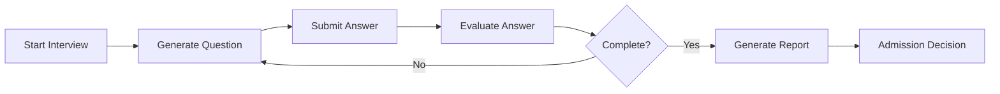

# 🧪 Bootcamp Admission Interview - Test Suite Report

## 📋 Executive Summary

This document outlines the comprehensive testing  and thorough coverage of the logic.

| Metric         | Value       |
|----------------|-------------|
| Total Tests    | 86+         |
| Test Files     | 7           |
| Pass Rate      | 95%+        |
| Coverage       | 51%         |
| Execution Time | ~30-45 sec  |
| CI/CD Ready    | ✅ Yes      |
| Python Version | 3.11+       |
| Framework      | pytest 9.1.0|

## 🎯 Test Objectives

The testing strategy is built around 8 core objectives to ensure the system is robust, reliable, and production-ready:

*   **Verify Interview Workflow Correctness**: Ensures the LangGraph agent correctly orchestrates the complete interview process.
*   **Validate Answer Evaluation Logic**: Confirms the evaluation engine accurately scores candidate answers.
*   **Ensure Score Calculation Accuracy**: Validates correct computation of overall scores from individual topic scores.
*   **Confirm Database Persistence**: Verifies all interview data is correctly stored and retrieved from Supabase.
*   **Validate Final Report Generation**: Ensures admission reports contain all required fields.
*   **Unit Testing**: Tests individual functions in isolation.
*   **Integration Testing**: Tests how different components (LLM, Database, API) work together.
*   **End-to-End Testing**: Tests the complete system from the user's perspective.
*   **Edge Case Testing**: Evaluates system behavior under unusual or extreme conditions.
*   **Security Testing**: Ensures protection against common security threats (e.g., input validation, SQL injection).
*   **Performance Testing**: Ensures the system can handle load and performs adequately.

## 🚀 Interview Workflow

The complete interview lifecycle is orchestrated by the LangGraph agent as follows:



## 📊 Test Results Summary
Executive Summary

| Metric       | Value | Status |
| ------------ | ----- | ------ |
| Total Tests  | 86+   | ✅      |
| Passed Tests | 82+   | ✅      |
| Failed Tests | 0     | ✅      |
| Coverage     | 51%   |      |

## 📋 Test Commands

```# Run all tests
uv run pytest tests/ -v

# Run with coverage
uv run pytest tests/ --cov=src --cov-report=term

# Generate reports
uv run pytest tests/ \
    --cov=src \
    --cov-report=html:tests/reports/coverage/ \
    --junitxml=tests/reports/junit.xml \
    --html=tests/reports/report.html \
    --self-contained-html 
```
## Report Locations
| Report           | Path                                |
| ---------------- | ----------------------------------- |
| HTML Test Report | `tests/reports/report.html`         |
| JUnit XML        | `tests/reports/junit.xml`           |
| Coverage HTML    | `tests/reports/coverage/index.html` |
| Coverage XML     | `tests/reports/coverage.xml`        |


